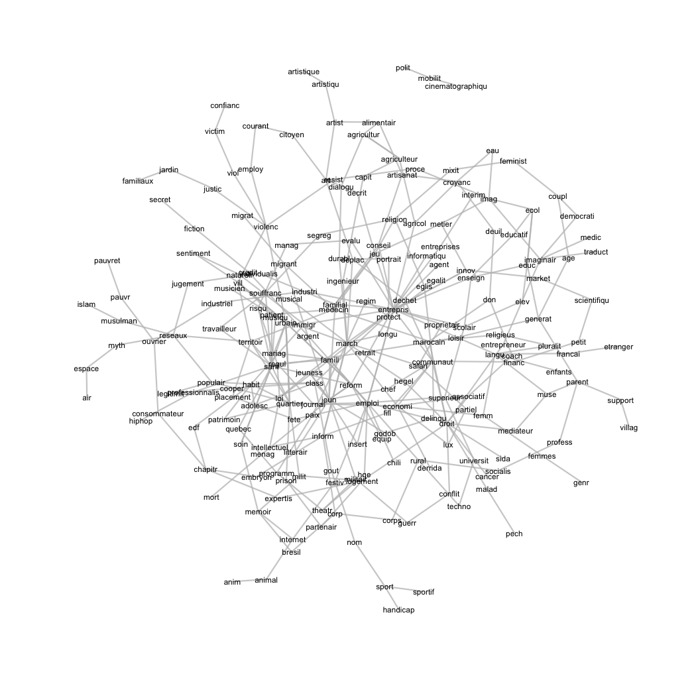
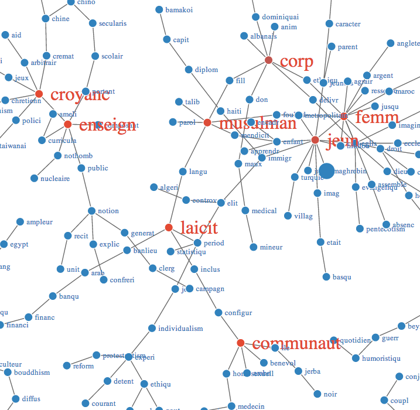

A quick try at [topic models](http://dx.doi.org/10.1016/j.poetic.2013.10.001) (see [discussion](http://scatter.wordpress.com/2013/12/04/topic-modeling-and-a-theory-of-language/)).

Run [`0.build.r`](0.build.r) from the `sociothese` folder to replicate the model and plots. The script sets a few model parameters and estimates LDA models:

1. first on summaries that match the `relig*` keyword: _N_ = 220 (runs in one hour)
2. and then on the full sample: _N_ = 3,219 (much slower, needs a dozen hours at least).

The functions come from [Grün and Hornik 2011](http://www.jstatsoft.org/v40/i13) or from [this example](https://github.com/qxde01/myRproj/tree/master/CloudAtlas) (in Japanese).

Here's what the topic models for the full sample look like [in network form](http://tedunderwood.com/2012/11/11/visualizing-topic-models/), trimmed down to the most common terms that appear in the summaries:



Instead of working with a `network` object, you can also turn the result of the `topic.graph` function into a [d3.js object](http://tedunderwood.com/2012/12/02/visualizing-topic-models-with-force-directed-graphs/) with Christopher Gandrud's [`d3Network`](http://cran.r-project.org/web/packages/d3Network/) function:

```S
library(devtools)
install_github("christophergandrud/d3Network")
library(d3Network)
d3SimpleNetwork(as.data.frame(g), file = "d3Network.html", 
                fontsize = 14, width = 800, height = 800, opacity = 1)
```

The result will be a clickable object on which you can underline the nodes with highest degree (the connecting terms that appear in many summaries):



If the `sociothese` repo is made public, [this link](http://htmlpreview.github.io/?https://github.com/briatte/sociothese/blob/master/d3Network.html) should display the d3 network.
